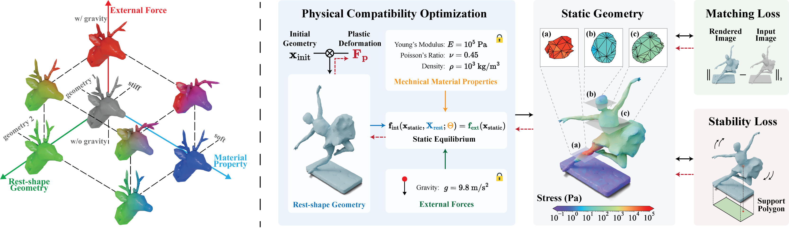

# Physically Compatible 3D Object Modeling from a Single Image
This repository contains the implementation code for the paper [Physically Compatible 3D Object Modeling from a Single Image](https://arxiv.org/pdf/2405.20283) in **Neurips 2024** (**<span style="color:red;">Spotlight</span>**).

We present a computational framework that transforms single images into 3D physical objects. The visual geometry of a physical object in an image is determined by three orthogonal attributes: mechanical properties, external forces, and rest-shape geometry. Existing single-view 3D reconstruction methods often overlook this underlying composition, presuming rigidity or neglecting external forces. Consequently, the reconstructed objects fail to withstand real-world physical forces, resulting in instability or undesirable deformation -- diverging from their intended designs as depicted in the image. Our optimization framework addresses this by embedding physical compatibility into the reconstruction process. We explicitly decompose the three physical attributes and link them through static equilibrium, which serves as a hard constraint, ensuring that the optimized physical shapes exhibit desired physical behaviors. 


(Left) The visual geometry of a physical object in an image is determined by three orthogonal attributes: mechanical properties, external forces, and rest-shape geometry. (Right) Given predefined mechanical properties and external forces, our pipeline optimizes the rest-shape geometry to ensure that the shape, when in a state of static equilibrium, aligns with the target image and meets stability criteria.


## Installation

### Prerequisites
- __libpgo:__ We developed the code using [libpgo](https://github.com/bohanwang/libpgo/tree/physcomp) as the infrastructure. Follow the instructions to create conda environment and install libpgo.
```bash
git clone git@github.com:bohanwang/libpgo.git
git checkout physcomp
cd libpgo
mkdir -p projects
cd projects
git clone git@github.com:gmh14/PhysComp.git
sudo apt install libgmp-dev libmpfr-dev
conda create --name physcomp python=3.10
conda activate physcomp
conda install tbb tbb-devel mkl mkl-devel
export CMAKE_BUILD_PARALLEL_LEVEL=8
pip install -v -e .
pip install trimesh tetgen
```

## Usage

Our framework provides two examples to demonstrate its functionality:

1. Soft Object Optimization for Image Matching (`matching()`)
2. Stiff Object Optimization for Stability (`stabilize()`)

The required files for these examples are located in the `examples/` directory.

To obtain the results, use the following commands:

```bash
python scripts/test.py
```
---

### Input Files
For both `matching()` and `stabilize()`:
- `reconstruct_res.veg`
  The initial reconstructed 3D model in `.veg` format.  
  - Detailed information on the `.veg` format can be found [here](https://github.com/bohanwang/libpgo/blob/2ddccbea9dd54651ea28f4d389ddefa10b574404/src/core/volumetricMesh/tetMesh.cpp#L62).  
  - If you have tetrahedral mesh vertices and elements in NumPy array format, you can convert and save them as `.veg` using this [script](https://github.com/gmh14/PhysComp/blob/c6d1685bc5f237d0c913f56e5a8c1ac421a6cc78/scripts/test.py#L41C5-L43C91).

- `fixed.txt`
  A list of vertex indices that are fixed during optimization.

---

### Output Files

Generated by `matching()`:
- `opt_init.veg` / `opt_init.obj`
  The optimized **rest shape** geometry of the 3D tetrahedral mesh in `.veg` format and its surface mesh in `.obj` format.

- `opt.veg` / `opt.obj` 
  The geometry of the **optimized rest shape under gravity** of the 3D tetrahedral mesh in `.veg` format and its surface mesh in `.obj` format.

- `static_eq_debug.veg` / `static_eq_debug.obj`
  The geometry of the **unoptimized rest shape under gravity** of the 3D tetrahedral mesh in `.veg` format and its surface mesh in `.obj` format.

Generated by `stabilize()`:
- `stand_opt_rest.veg` / `stand_opt_rest.obj` 
  The optimized **rest shape** geometry of the 3D tetrahedral mesh in `.veg` format and its surface mesh in `.obj` format.

- `stand_opt.veg` / `stand_opt.obj` 
  The geometry of the **optimized rest shape under gravity** of the 3D tetrahedral mesh in `.veg` format and its surface mesh in `.obj` format.


Feel free to explore the `examples/` directory for additional resources and scripts.

---

For stability evaluation, we use [rigid-ipc](https://github.com/ipc-sim/rigid-ipc). The configuration JSON file for rigid-ipc is ``examples/unicorn_rigid_ipc.json``. Change the input mesh path to ``stand_opt_rest_scaled.obj`` which is scaled to a proper size for visualization.

## WIP Features
- [ ] Release the data

- [ ] More instructions for the usage


## Citation
If you find the idea or code useful for your research, please cite [our paper](https://arxiv.org/abs/2405.20510):
```bib
@article{guo2024physically,
  title={Physically Compatible 3D Object Modeling from a Single Image},
  author={Guo, Minghao and Wang, Bohan and Ma, Pingchuan and Zhang, Tianyuan and Owens, Crystal Elaine and Gan, Chuang and Tenenbaum, Joshua B and He, Kaiming and Matusik, Wojciech},
  journal={Advances in Neural Information Processing Systems},
  year={2024}
}
```


## Contact
Don't hesitate to contact guomh2014@gmail.com if you have any questions. Enjoy!
